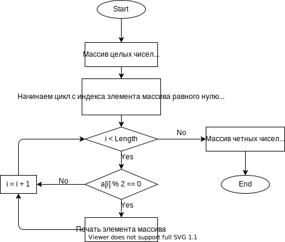

# Итоговая проверочная работа
## Задача:  
Написать программу, которая из имеющегося массива целых чисел формирует массив из четных чисел. Первоначальный массив можно ввести с клавиатуры, либо сгенерировать случайным образом. При решении не рекомендуется пользоваться коллекциями, лучше обойтись исключительно массивами.

## Решение:
Попытки сделать "красиво" убились об суровую реальность - за 8 рабочих часов я так и не смог собрать отдельные методы в работающую структуру типа: генерируем массив - печатаем массив - находим в нем четные числа - печатаем... 

Поэтому, решил простейшим методом: ввел массив ручками и распечатал в терминал только четные элементы массива.

Блок-схема решения находиться в этом же репозитории: Flowchart.drawio.svg

Суть решения, как и писал ранее:
* массив вводим руками, как исходные данные задачи
* прогоняем его по циклу, в котором элементы удовлетворяющие условию - остаток от деления на 2 будет равен нулю (одно из свойств четных чисел) - распечатываются в терминал, друг за другом, через пробел в одну строку
* элементы массива не удовлетворяющие условию - пропускаются
* цикл завершается сразу, как пройдет по всем элементам массива
* конец
